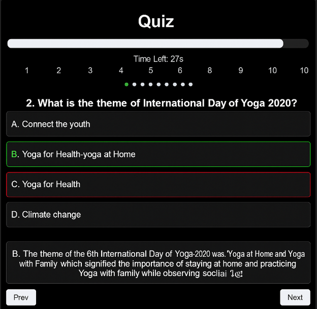

# ThinkQuest - Quiz App

ThinkQuest is a feature-rich quiz application designed to make learning fun and interactive! Built with a modern web stack—HTML, CSS, JavaScript, and Python (Flask)—ThinkQuest allows users to test their knowledge across multiple topics, all without the hassle of logging in.

---

## 🚀 Features

- **Multiple Topics:** Choose from a variety of quiz subjects to challenge yourself.
- **Timed Questions:** Each question comes with a 30-second reverse timer to keep the excitement high.
- **Enhanced User Experience:** Implemented a visually appealing interface with progress indicators, real-time answer validation, and personalized explanations for incorrect answers.
- **Instant Results:** Get your score and detailed feedback immediately after completing the quiz.
- **No Login Required:** Jump right into the action—no sign-up or login necessary.
- **Feedback:** Receive tailored feedback on your performance.

---

## 🛠️ Tech Stack

- **Frontend:** HTML, CSS, JavaScript
- **Backend:** Python (Flask)

---

## 💻 Getting Started

### 1. Clone the Repository

```bash
git clone https://github.com/prachigehlot07/ThinkQuest-QuizApp.git
cd ThinkQuest-QuizApp
```

### 2. Install Backend Dependencies

Ensure you have [Python 3.x](https://www.python.org/downloads/) installed.

```bash
pip install -r requirements.txt
```

### 3. Run the Flask App

```bash
python app.py
```

The quiz app will be available at `http://localhost:5000`.

---

## 📸 Screenshots

Home page


Quiz page




Result page


---

## 🔧 Contributors

[](https://github.com/prachigehlot07/ThinkQuest-QuizApp/graphs/contributors)

---

Happy quizzing! 🚀
